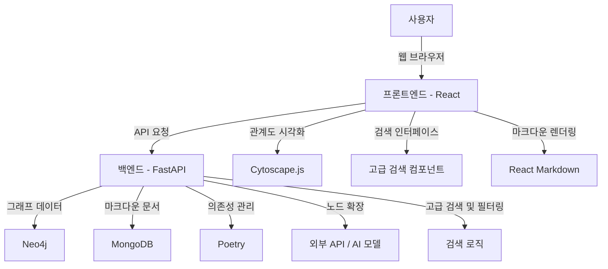

# AI Knowledge Graph

AI 관련 개념과 지식을 시각화하고 탐색할 수 있는 지식 그래프 애플리케이션입니다.

## 기능

- 노드 생성, 조회, 수정, 삭제
- 엣지 생성, 조회, 삭제
- 키워드 및 카테고리 기반 검색
- 그래프 시각화
- 마크다운 형식의 상세 내용 지원

## 기술 스택

- 백엔드: FastAPI, Neo4j, MongoDB
- 프론트엔드: React, Cytoscape.js
- 테스트: Pytest, React Testing Library

## 프로젝트 구조



## 설치 및 실행

1. 저장소 클론
   ```
   git clone https://github.com/your-username/ai-knowledge-graph.git
   cd ai-knowledge-graph
   ```

2. 백엔드 설정
   ```
   poetry install
   poetry shell
   uvicorn main:app --reload
   ```

3. 프론트엔드 설정
   ```
   cd frontend
   npm install
   npm start
   ```

4. 브라우저에서 `http://localhost:3000` 접속

## API 문서

API 문서는 `http://localhost:8000/docs`에서 확인할 수 있습니다.

## 테스트

백엔드 테스트:
```
pytest
```

프론트엔드 테스트:
```
cd frontend
npm test
```

## 기여

버그 리포트, 기능 제안, 풀 리퀘스트를 환영합니다. 주요 변경사항은 먼저 이슈를 열어 논의해주세요.

## 라이선스

이 프로젝트는 MIT 라이선스 하에 있습니다. 자세한 내용은 [LICENSE](LICENSE) 파일을 참조하세요.