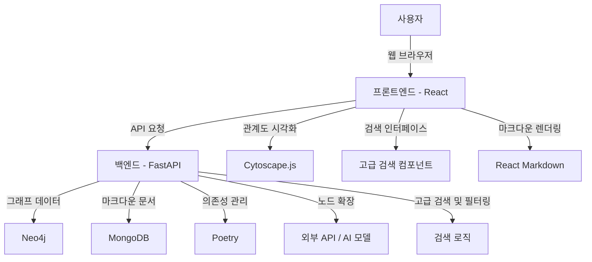

```mermaid
graph TD
    A[사용자] -->|웹 브라우저| B[프론트엔드 - React]
    B -->|API 요청| C[백엔드 - FastAPI]
    C -->|그래프 데이터| D[Neo4j]
    C -->|마크다운 문서| E[MongoDB]
    C -->|의존성 관리| F[Poetry]
    C -->|노드 확장| G[외부 API / AI 모델]
    B -->|관계도 시각화| H[Cytoscape.js]
    B -->|검색 인터페이스| I[고급 검색 컴포넌트]
    B -->|마크다운 렌더링| J[React Markdown]
    C -->|고급 검색 및 필터링| K[검색 로직]
```